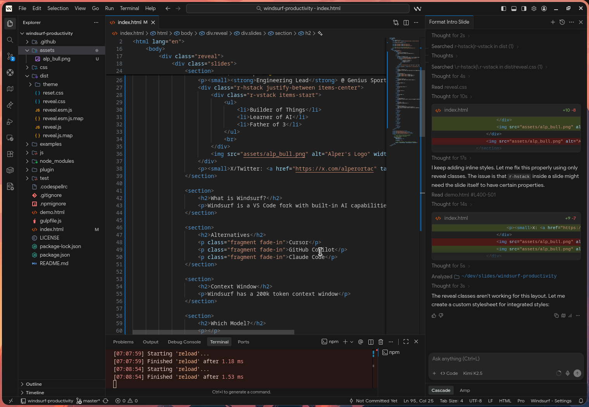

<table><tr><td>

 

## 🚨🚨🚨 PRICING INFORMATION OUTDATED 🚨🚨🚨

 

### ❌ Windsurf has ABANDONED the credits-based pricing model shown in these slides.

 

They now enforce a **usage-based quota** with strict **daily and weekly limits** 
that makes the tool **barely usable** for professional work.

 

| | Old Model (in slides) | New Model (current) |
|---|---|---|
| **System** | Credits per prompt | Usage-based quota |
| **Limits** | Monthly pool, roll-over | **Daily + weekly hard caps** |
| **Predictability** | ✅ High | ❌ Low |
| **Value** | ✅ Great | ❌ Poor |

 

### ⛔ Even the $200/month plan is more limited than competing tools at lower prices.

 

Check Windsurf pricing for current details before subscribing.

 

</td></tr></table>

# Coding with Windsurf

**Optimizing for Cost and Productivity**

A slide deck covering how to get the most out of [Windsurf](https://windsurf.com/) - a VS Code fork with built-in AI capabilities. Topics include pricing & credits, model selection strategies, productivity workflows, and practical tips for AI-assisted development.

## 🔗 View the Slides

👉 [**alp82.github.io/windsurf-productivity**](https://alp82.github.io/windsurf-productivity/)

## Author

**Alper Ortac** — [𝕏 @alperortac](https://x.com/alperortac)

Built with [reveal.js](https://revealjs.com/).
